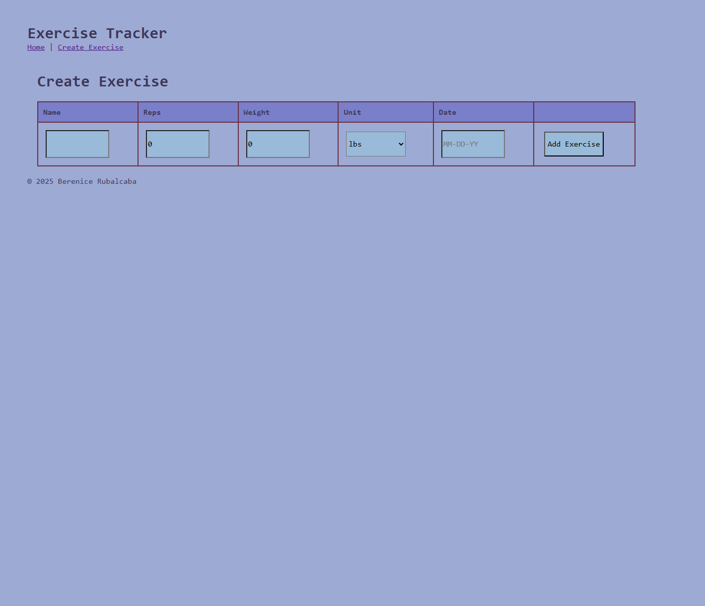

# Fitness Tracker

Portfolio project for CS290 Web Development, A full-stack MERN application for tracking exercise workouts.

## Features
- Adds new exercises with reps, weight, unit, and date
- View all exercises in a table format
- Edit existing exercises
- Delete exercises in the table
- uses MongoDB to handle data

## Screenshots

### Create Exercise Page

## Contains
- **Frontend:** React with Vite
- **Backend:** Node.js with Express
- **Database:** MongoDB
- **Styling:** CSS

## Installation
1. Clone the repository or download the files
2. Install dependencies for both frontend and backend
3. Set up MongoDB connection on the .env file 
4. Run both servers and open in browser
